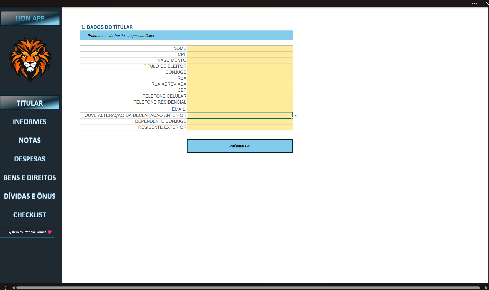
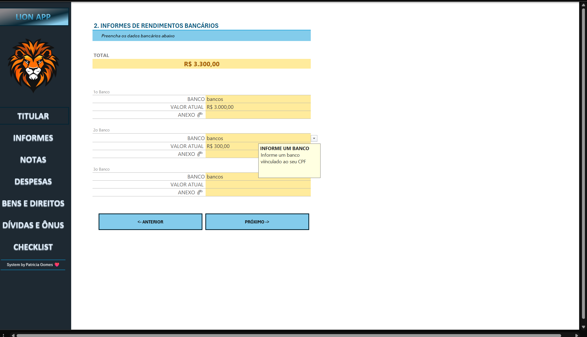
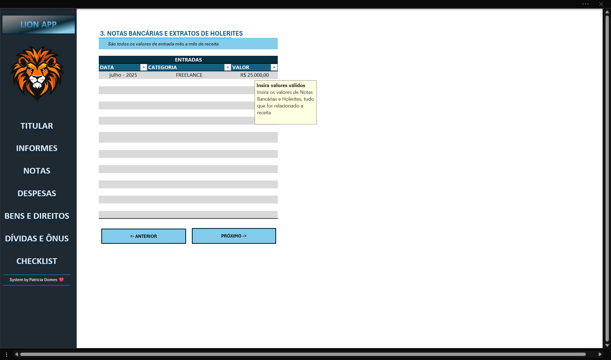
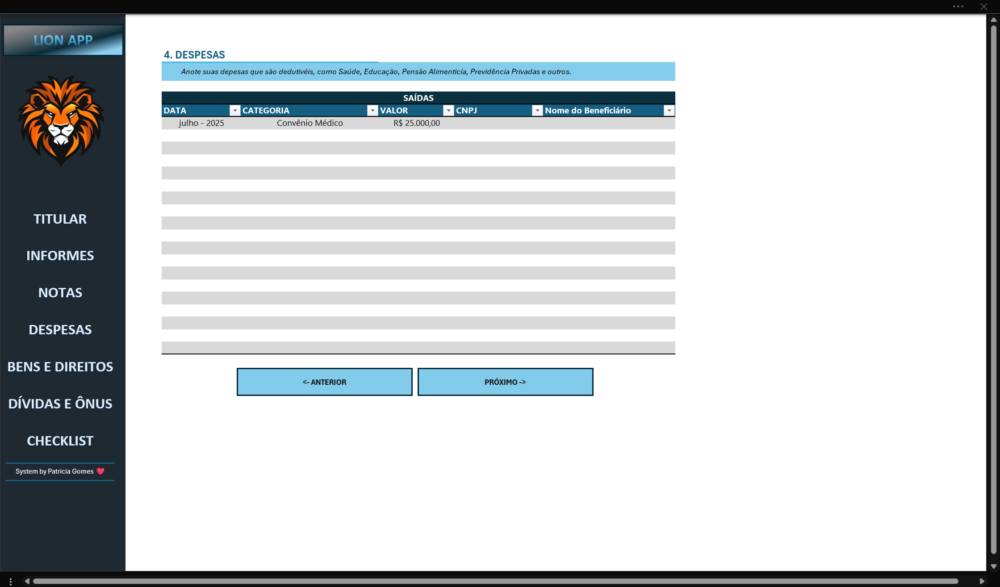
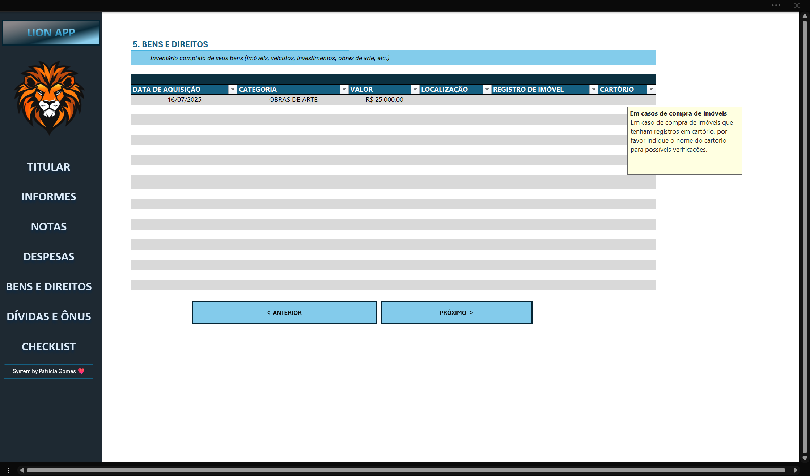
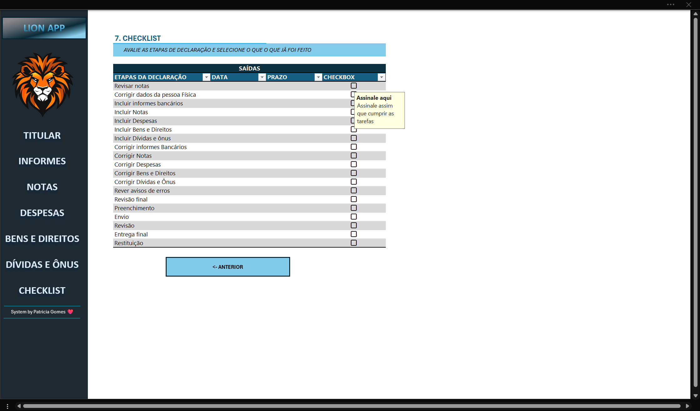

# Projetos_CursoDIO

# LION APP - Suporte para Declaração de Imposto de Renda (IRPF)

Este projeto se trata de ume excel/APP que tem como objetivo auxiliar a entrega da declaração de renda (IRPF) anual. Este app irá auxiliar o contribuinte a entregar sua declaração com todos os dados devidos e mapeados para enviar ao contador que o auxiliará no processo da entrega do IRPF. 

🦁 Processos da Declaração no LION APP

📚 Página 1: Dados do Titular 

Neste campo visamos buscar os dados pessois do contribuinte como dados chave CPF, telefone, endereços e outros e dados descritivos como nome, conjugê e emails. 

💵 Página 2: Informe de Rendimentos Bancários

Nesta página, buscamos mapear todas as receitas do contribuinte, assim como os dados bancárias das mesmas. Desta forma conseguimos auxiliar o contador a verificar as entradas de renda do cliente. 

📖 Página 3:Notas

Nesta página temos as informçaões e backups de notas fiscais. Essas notas serão necessárias 
para auxiliar em toda documentação formal para emisssão da declaração. 

💸 Página 4: Despesas

Nesta página, mapeamos as despesas do contribuinte, afim de validar o que conseguimos deduzir do imposto declarado. 

🏠Página 5: Bens e Direitos

Aqui mapeamos se o contribuinte tem bens e direitos a serem declarados e ou adicionados para afim de auxiliar o contador nos dados da declaração. 

💳 Página 6: Dívidas e Ônus 

Nesta página mapeamos as dívidas e Ônus que foram feitas pelo contribuinte sempre com o objetivo de auxilixar nas informações mais completas e detalhadas, assim como ajudar a reduzir o imposto devido. 

✅ Página 7: Checklist

Por fim nesta última página temos o checklist da declaração. O objetivo é auxiliar o contribuinte e contador na emissão da declaração com validações das etapas de entrega de todo o processo, desde a coleta das informações atém a entrega da declaração e possíveis revisões e pagamentos

# System APP EXCEL FILE 

[excel file](<../../../Área de Trabalho/DIO - EXCEL COM IA/LION APP.xlsx>)

